NOAA Shrimp ELB Analaysis 
========================================================

# updated: 2013-11-14


## Base model run on 1 week integrated data


```r
m.1wk <- gam(log(towhours + 1) ~ factor(yr) + la_fuel_price + hrs + s(depth) + 
    s(ppnd) + s(jd) + s(cent_lon, cent_lat) + s(cent_lon, cent_lat, by = do), 
    data = gam.1wk.dur)
```


Base model:
- year as factor
- fuel price (based on Los Angeles times series) is a parametric term
- fishery effort (based on SHRCOM values) is included as a parametric term
- smooths are depth, price per pound, julian day and location
- variable coefficient term = location by do  


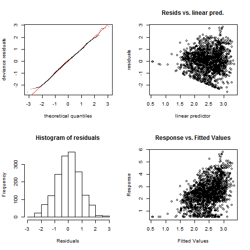

```
## 
## Method: GCV   Optimizer: magic
## Smoothing parameter selection converged after 12 iterations by steepest
## descent step failure.
## The RMS GCV score gradiant at convergence was 0.0009035 .
## The Hessian was not positive definite.
## The estimated model rank was 91 (maximum possible: 94)
## 
## Basis dimension (k) checking results. Low p-value (k-index<1) may
## indicate that k is too low, especially if edf is close to k'.
## 
##                             k'    edf k-index p-value
## s(depth)                 9.000  2.742   0.856    0.00
## s(ppnd)                  9.000  6.528   0.994    0.35
## s(jd)                    9.000  2.271   0.993    0.38
## s(cent_lon,cent_lat)    29.000 19.606   0.908    0.00
## s(cent_lon,cent_lat):do 30.000  9.877   0.798    0.00
```


Model check looks fine.  


```
## 
## Attaching package: 'xtable'
## 
## The following object is masked from 'package:maptools':
## 
##     label
```

```
## 
## Family: gaussian 
## Link function: identity 
## 
## Formula:
## log(towhours + 1) ~ factor(yr) + la_fuel_price + hrs + s(depth) + 
##     s(ppnd) + s(jd) + s(cent_lon, cent_lat) + s(cent_lon, cent_lat, 
##     by = do)
## 
## Parametric coefficients:
##                 Estimate Std. Error t value Pr(>|t|)    
## (Intercept)     3.92e-01   5.40e-02    7.25  6.3e-13 ***
## factor(yr)2006 -3.45e-02   1.54e-01   -0.22   0.8229    
## factor(yr)2007  1.93e-01   1.21e-01    1.60   0.1097    
## factor(yr)2008 -3.72e-01   8.17e-02   -4.55  5.8e-06 ***
## factor(yr)2009  7.46e-01   1.25e-01    5.98  2.7e-09 ***
## factor(yr)2010  9.14e-01   1.40e-01    6.52  9.5e-11 ***
## la_fuel_price   4.16e-01   6.04e-02    6.89  8.3e-12 ***
## hrs             5.94e-07   2.01e-07    2.95   0.0032 ** 
## ---
## Signif. codes:  0 '***' 0.001 '**' 0.01 '*' 0.05 '.' 0.1 ' ' 1
## 
## Approximate significance of smooth terms:
##                           edf Ref.df    F p-value    
## s(depth)                 2.74   3.47 5.85 0.00032 ***
## s(ppnd)                  6.53   7.66 3.21 0.00158 ** 
## s(jd)                    2.27   2.97 1.62 0.18189    
## s(cent_lon,cent_lat)    19.61  22.90 1.24 0.20165    
## s(cent_lon,cent_lat):do  9.88  12.37 0.38 0.97280    
## ---
## Signif. codes:  0 '***' 0.001 '**' 0.01 '*' 0.05 '.' 0.1 ' ' 1
## 
## R-sq.(adj) =  0.167   Deviance explained =   19%
## GCV score = 0.85433  Scale est. = 0.82985   n = 1641
```


One week model results:
- 2006 and 2007 are not significant
- Smooths for Julian day and Location and location by do were **not significant**


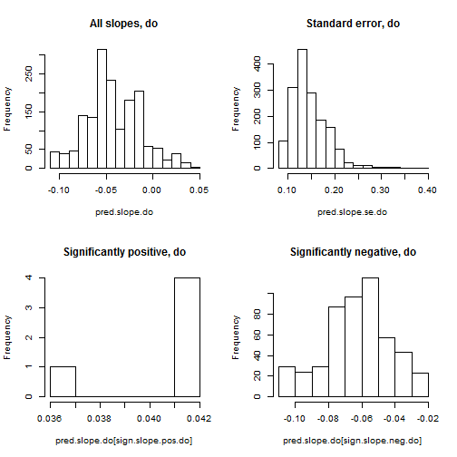


Model slopes from the 1 week data set:
- both positive and negative slopes present
- similar distributions for both sets of significant slopes  


```
## Error: plot.new has not been called yet
```


# 1 week model results:
- fishing effort has a negative relationship with depth (remember on LA)
- Price has a negative effect below '$1.50' but no real positive or negative effect at higher values
- Julian day shows a peak effect on effort around 180 to 190 days.
- Spatially, predicted effort is highest in nearshore environments aroun the LA bight and off Terrebonne Parish.
- Model slopes are negative off Terrebonne, moving west through midshore and along western LA at all depths  


## Louisiana base model with 6 week data integration


```r
m.2mo.dur.la <- gam(log(towhours + 1) ~ factor(yr) + la_fuel_price + hrs + areaOB + 
    +s(depth) + s(ppnd) + s(jd) + s(cent_lon, cent_lat) + s(cent_lon, cent_lat, 
    by = do), data = gam.2mo.dur.la)

nspm.2mo.dur.la <- gam(log(towhours + 1) ~ factor(yr) + la_fuel_price + hrs + 
    s(do) + s(depth) + s(ppnd) + s(jd) + s(cent_lon, cent_lat), data = gam.2mo.dur.la)

aream.2mo.dur.la <- gam(log(towhours + 1) ~ factor(yr) + la_fuel_price + hrs + 
    areaOB + +s(do) + s(depth) + s(ppnd) + s(jd) + s(cent_lon, cent_lat) + s(cent_lon, 
    cent_lat, by = areaOB), data = gam.2mo.dur.la)
```


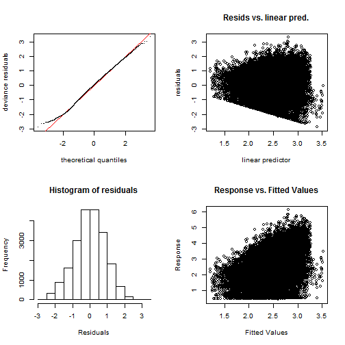

```
## 
## Method: GCV   Optimizer: magic
## Smoothing parameter selection converged after 16 iterations.
## The RMS GCV score gradiant at convergence was 4.946e-07 .
## The Hessian was positive definite.
## The estimated model rank was 90 (maximum possible: 96)
## 
## Basis dimension (k) checking results. Low p-value (k-index<1) may
## indicate that k is too low, especially if edf is close to k'.
## 
##                             k'    edf k-index p-value
## s(depth)                 9.000  7.041   0.711    0.00
## s(ppnd)                  9.000  6.262   0.976    0.05
## s(jd)                    9.000  6.884   1.005    0.61
## s(cent_lon,cent_lat)    29.000 27.714   0.925    0.00
## s(cent_lon,cent_lat):do 30.000 26.717   0.860    0.00
```


## model diagnostics look ok


```
## Error: "align" must have length equal to 1 ( ncol(x) + 1 )
```

```
## Error: object 'm.2mo.dur.la.table' not found
```


Louisiana model results (6 week integration):
- most years significant **except** 2005
- all smooths are significant  
- deviance explained is 15.3%


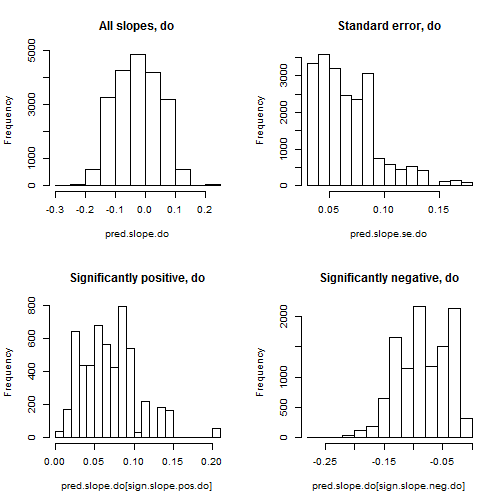


The slopes are both positive and negative.  

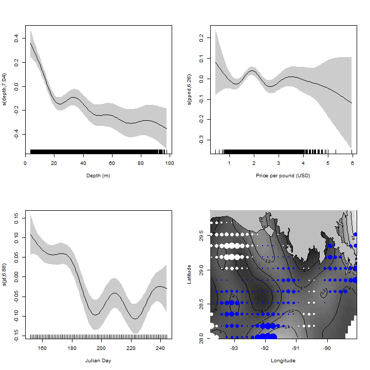


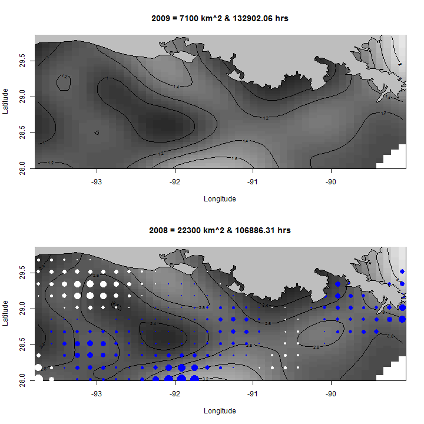


## Texas base model with 6 week data integration


```r
m.2mo.dur.tx <- gam(log(towhours + 1) ~ factor(yr) + la_fuel_price + hrs + s(depth) + 
    s(ppnd) + s(jd) + s(cent_lon, cent_lat) + s(cent_lon, cent_lat, by = do), 
    data = gam.2mo.dur.tx)

nspm.2mo.dur.tx <- gam(log(towhours + 1) ~ factor(yr) + la_fuel_price + hrs + 
    s(do) + s(depth) + s(ppnd) + s(jd) + s(cent_lon, cent_lat), data = gam.2mo.dur.tx)

aream.2mo.dur.tx <- gam(log(towhours + 1) ~ factor(yr) + la_fuel_price + hrs + 
    areaOB + +s(do) + s(depth) + s(ppnd) + s(jd) + s(cent_lon, cent_lat) + s(cent_lon, 
    cent_lat, by = areaOB), data = gam.2mo.dur.tx)
```


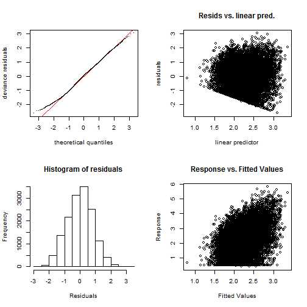

```
## 
## Method: GCV   Optimizer: magic
## Smoothing parameter selection converged after 13 iterations by steepest
## descent step failure.
## The RMS GCV score gradiant at convergence was 7.947e-05 .
## The Hessian was positive definite.
## The estimated model rank was 89 (maximum possible: 95)
## 
## Basis dimension (k) checking results. Low p-value (k-index<1) may
## indicate that k is too low, especially if edf is close to k'.
## 
##                             k'    edf k-index p-value
## s(depth)                 9.000  6.223   0.742    0.00
## s(ppnd)                  9.000  6.987   0.978    0.06
## s(jd)                    9.000  7.839   0.990    0.21
## s(cent_lon,cent_lat)    29.000 24.405   0.976    0.02
## s(cent_lon,cent_lat):do 30.000 22.499   0.898    0.00
```


```
## 
## Family: gaussian 
## Link function: identity 
## 
## Formula:
## log(towhours + 1) ~ factor(yr) + la_fuel_price + hrs + s(depth) + 
##     s(ppnd) + s(jd) + s(cent_lon, cent_lat) + s(cent_lon, cent_lat, 
##     by = do)
## 
## Parametric coefficients:
##                Estimate Std. Error t value Pr(>|t|)    
## (Intercept)    1.05e+00   1.10e-01    9.53  < 2e-16 ***
## factor(yr)2005 1.52e-01   3.77e-02    4.03  5.6e-05 ***
## factor(yr)2006 2.29e-01   4.47e-02    5.13  3.0e-07 ***
## factor(yr)2007 1.86e-01   3.88e-02    4.79  1.7e-06 ***
## factor(yr)2008 3.83e-01   8.81e-02    4.35  1.4e-05 ***
## factor(yr)2009 6.42e-01   2.73e-02   23.50  < 2e-16 ***
## factor(yr)2010 5.26e-01   3.10e-02   16.95  < 2e-16 ***
## la_fuel_price  1.88e-01   5.03e-02    3.73  0.00019 ***
## hrs            1.97e-07   2.59e-08    7.63  2.4e-14 ***
## ---
## Signif. codes:  0 '***' 0.001 '**' 0.01 '*' 0.05 '.' 0.1 ' ' 1
## 
## Approximate significance of smooth terms:
##                           edf Ref.df     F p-value    
## s(depth)                 6.22   7.22  9.66 3.0e-12 ***
## s(ppnd)                  6.99   7.70  5.16 3.2e-06 ***
## s(jd)                    7.84   7.98 37.97 < 2e-16 ***
## s(cent_lon,cent_lat)    24.40  25.59  6.64 < 2e-16 ***
## s(cent_lon,cent_lat):do 22.50  25.84  4.73 2.3e-14 ***
## ---
## Signif. codes:  0 '***' 0.001 '**' 0.01 '*' 0.05 '.' 0.1 ' ' 1
## 
## R-sq.(adj) =   0.14   Deviance explained = 14.4%
## GCV score = 0.70116  Scale est. = 0.69758   n = 14899
```


```
## Error: subscript out of bounds
```

```
## Error: subscript out of bounds
```

```
## Error: subscript out of bounds
```

```
## Error: subscript out of bounds
```


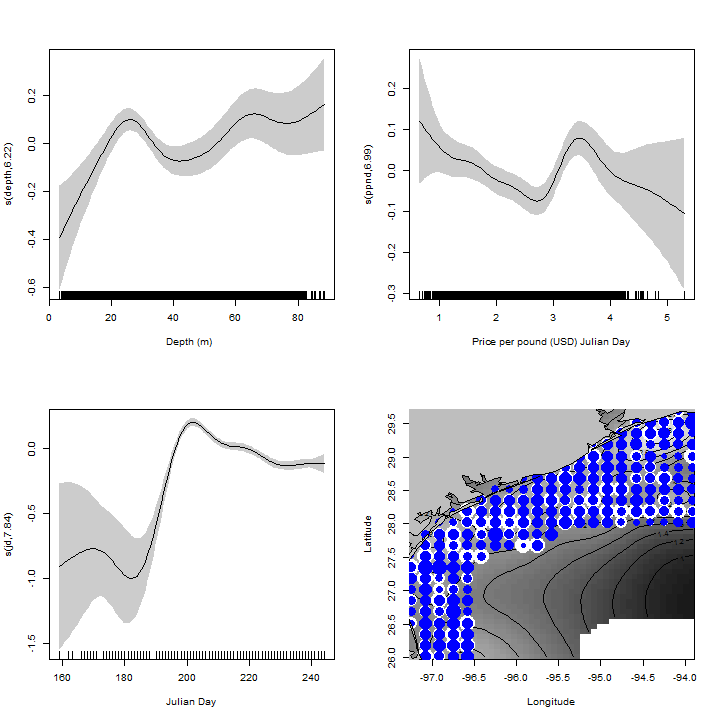


### Secondary Response variables


```r
m.2mo.tow.count.la <- gam(tow.cnt ~ factor(yr) + la_fuel_price + hrs + s(depth) + 
    s(ppnd) + s(jd) + s(cent_lon, cent_lat) + s(cent_lon, cent_lat, by = do), 
    family = poisson, data = gam.2mo.tow.count.la)
```


gam.check(m.2mo.tow.count.la)

```r
summary(m.2mo.tow.count.la)
```

```
## 
## Family: poisson 
## Link function: log 
## 
## Formula:
## tow.cnt ~ factor(yr) + la_fuel_price + hrs + s(depth) + s(ppnd) + 
##     s(jd) + s(cent_lon, cent_lat) + s(cent_lon, cent_lat, by = do)
## 
## Parametric coefficients:
##                 Estimate Std. Error z value Pr(>|z|)    
## (Intercept)     0.00e+00   0.00e+00      NA       NA    
## factor(yr)2005  3.42e-01   9.30e-02    3.68  0.00024 ***
## factor(yr)2006  5.51e-01   8.82e-02    6.25  4.0e-10 ***
## factor(yr)2007  6.27e-01   8.19e-02    7.65  2.1e-14 ***
## factor(yr)2008  1.23e+00   9.88e-02   12.47  < 2e-16 ***
## factor(yr)2009  9.68e-01   7.20e-02   13.45  < 2e-16 ***
## factor(yr)2010  1.08e+00   6.96e-02   15.49  < 2e-16 ***
## la_fuel_price  -1.38e-01   2.63e-02   -5.23  1.7e-07 ***
## hrs             4.13e-07   4.96e-08    8.32  < 2e-16 ***
## ---
## Signif. codes:  0 '***' 0.001 '**' 0.01 '*' 0.05 '.' 0.1 ' ' 1
## 
## Approximate significance of smooth terms:
##                           edf Ref.df Chi.sq p-value    
## s(depth)                 8.79   8.99  247.4 < 2e-16 ***
## s(ppnd)                  8.12   8.81   53.3 2.5e-08 ***
## s(jd)                    8.89   9.00 1125.1 < 2e-16 ***
## s(cent_lon,cent_lat)    28.95  29.00 1048.6 < 2e-16 ***
## s(cent_lon,cent_lat):do 29.18  29.94  480.6 < 2e-16 ***
## ---
## Signif. codes:  0 '***' 0.001 '**' 0.01 '*' 0.05 '.' 0.1 ' ' 1
## 
## R-sq.(adj) =   0.12   Deviance explained =   17%
## UBRE score = 1.0886  Scale est. = 1         n = 21102
```


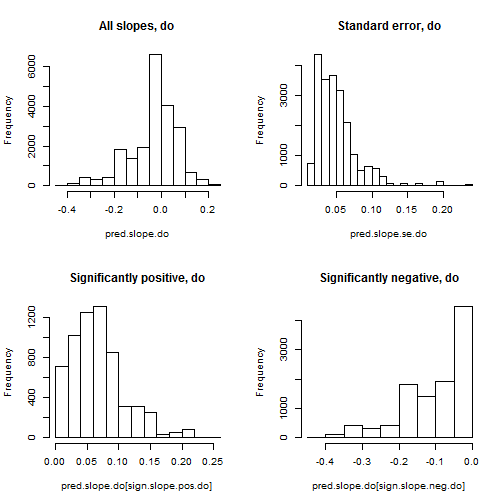


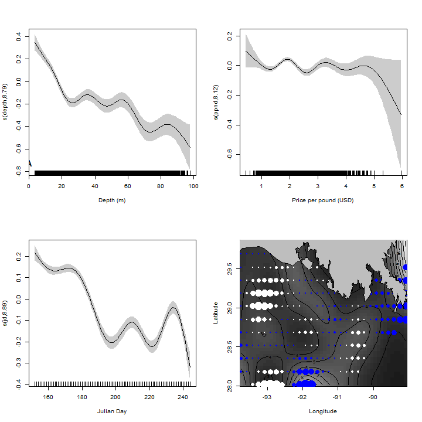


```r
m.2mo.tow.count.tx <- gam(tow.cnt ~ factor(yr) + la_fuel_price + hrs + s(depth) + 
    s(ppnd) + s(jd) + s(cent_lon, cent_lat) + s(cent_lon, cent_lat, by = do), 
    family = poisson, data = gam.2mo.tow.count.tx)
```


```
## 
## Family: poisson 
## Link function: log 
## 
## Formula:
## tow.cnt ~ factor(yr) + la_fuel_price + hrs + s(depth) + s(ppnd) + 
##     s(jd) + s(cent_lon, cent_lat) + s(cent_lon, cent_lat, by = do)
## 
## Parametric coefficients:
##                Estimate Std. Error z value Pr(>|z|)    
## (Intercept)    0.00e+00   0.00e+00      NA       NA    
## factor(yr)2005 2.35e-01   4.75e-02    4.94  7.8e-07 ***
## factor(yr)2006 7.52e-02   5.78e-02    1.30     0.19    
## factor(yr)2007 2.97e-02   5.75e-02    0.52     0.61    
## factor(yr)2008 5.29e-02   1.01e-01    0.53     0.60    
## factor(yr)2009 4.65e-01   5.06e-02    9.19  < 2e-16 ***
## factor(yr)2010 2.40e-01   5.99e-02    4.01  6.1e-05 ***
## la_fuel_price  2.49e-01   3.30e-02    7.54  4.7e-14 ***
## hrs            1.43e-07   2.84e-08    5.02  5.2e-07 ***
## ---
## Signif. codes:  0 '***' 0.001 '**' 0.01 '*' 0.05 '.' 0.1 ' ' 1
## 
## Approximate significance of smooth terms:
##                           edf Ref.df Chi.sq p-value    
## s(depth)                 8.69   8.97  251.3 < 2e-16 ***
## s(ppnd)                  8.23   8.84   73.5 3.3e-12 ***
## s(jd)                    8.77   8.96 1234.8 < 2e-16 ***
## s(cent_lon,cent_lat)    28.95  28.99  306.6 < 2e-16 ***
## s(cent_lon,cent_lat):do 27.33  29.47  258.0 < 2e-16 ***
## ---
## Signif. codes:  0 '***' 0.001 '**' 0.01 '*' 0.05 '.' 0.1 ' ' 1
## 
## R-sq.(adj) =  0.105   Deviance explained = 14.4%
## UBRE score = 0.80894  Scale est. = 1         n = 14899
```


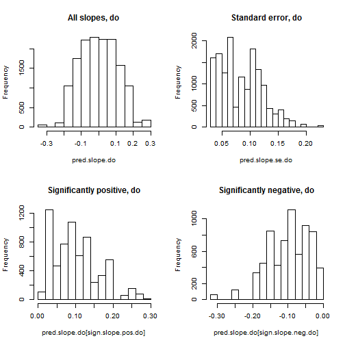


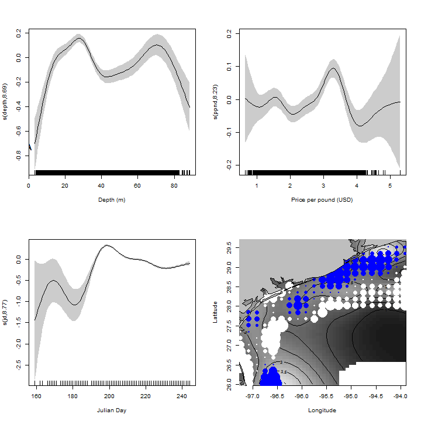


```r
m.2mo.avg.dur.la <- gam(avg.dur ~ factor(yr) + la_fuel_price + hrs + s(depth) + 
    s(ppnd) + s(jd) + s(cent_lon, cent_lat) + s(cent_lon, cent_lat, by = do), 
    data = gam.2mo.avg.dur.la)

summary(m.2mo.avg.dur.la)
```

```
## 
## Family: gaussian 
## Link function: identity 
## 
## Formula:
## avg.dur ~ factor(yr) + la_fuel_price + hrs + s(depth) + s(ppnd) + 
##     s(jd) + s(cent_lon, cent_lat) + s(cent_lon, cent_lat, by = do)
## 
## Parametric coefficients:
##                 Estimate Std. Error t value Pr(>|t|)    
## (Intercept)     3.62e+00   3.19e-01   11.35  < 2e-16 ***
## factor(yr)2005 -5.55e-01   2.02e-01   -2.75  0.00596 ** 
## factor(yr)2006  6.30e-01   1.68e-01    3.76  0.00017 ***
## factor(yr)2007  1.32e+00   1.33e-01    9.89  < 2e-16 ***
## factor(yr)2008  1.99e+00   2.20e-01    9.08  < 2e-16 ***
## factor(yr)2009  1.75e+00   8.89e-02   19.69  < 2e-16 ***
## factor(yr)2010  1.74e+00   7.23e-02   24.12  < 2e-16 ***
## la_fuel_price  -1.56e-01   1.08e-01   -1.43  0.15148    
## hrs             5.94e-07   2.24e-07    2.65  0.00810 ** 
## ---
## Signif. codes:  0 '***' 0.001 '**' 0.01 '*' 0.05 '.' 0.1 ' ' 1
## 
## Approximate significance of smooth terms:
##                           edf Ref.df     F p-value    
## s(depth)                 6.80   7.60  7.05 7.4e-09 ***
## s(ppnd)                  2.53   3.22  0.98     0.4    
## s(jd)                    4.53   5.56 19.76 < 2e-16 ***
## s(cent_lon,cent_lat)    27.26  27.83  6.24 < 2e-16 ***
## s(cent_lon,cent_lat):do 26.82  29.13  6.44 < 2e-16 ***
## ---
## Signif. codes:  0 '***' 0.001 '**' 0.01 '*' 0.05 '.' 0.1 ' ' 1
## 
## R-sq.(adj) =  0.127   Deviance explained =   13%
## GCV score = 5.5429  Scale est. = 5.523     n = 21102
```


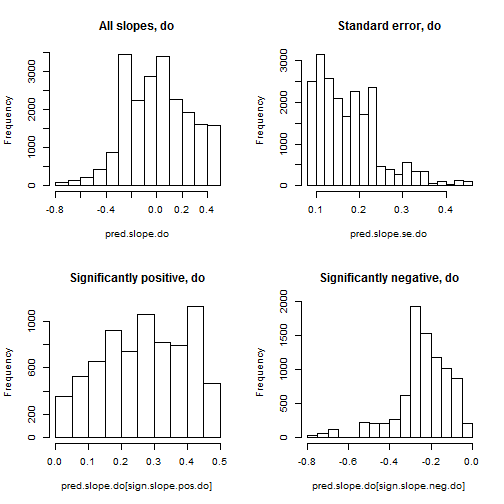


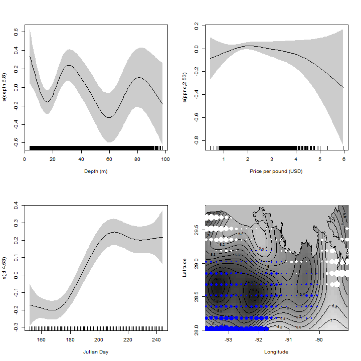


```r
m.2mo.avg.dur.tx <- gam(avg.dur ~ factor(yr) + la_fuel_price + hrs + s(depth) + 
    s(ppnd) + s(jd) + s(cent_lon, cent_lat) + s(cent_lon, cent_lat, by = do), 
    data = gam.2mo.avg.dur.tx)

summary(m.2mo.avg.dur.tx)
```

```
## 
## Family: gaussian 
## Link function: identity 
## 
## Formula:
## avg.dur ~ factor(yr) + la_fuel_price + hrs + s(depth) + s(ppnd) + 
##     s(jd) + s(cent_lon, cent_lat) + s(cent_lon, cent_lat, by = do)
## 
## Parametric coefficients:
##                 Estimate Std. Error t value Pr(>|t|)    
## (Intercept)     2.99e+00   3.17e-01    9.43  < 2e-16 ***
## factor(yr)2005 -1.29e-01   1.09e-01   -1.19     0.24    
## factor(yr)2006  5.99e-01   1.29e-01    4.65  3.4e-06 ***
## factor(yr)2007  6.08e-01   1.12e-01    5.43  5.9e-08 ***
## factor(yr)2008  1.61e+00   2.54e-01    6.34  2.4e-10 ***
## factor(yr)2009  1.47e+00   7.90e-02   18.60  < 2e-16 ***
## factor(yr)2010  1.60e+00   8.98e-02   17.81  < 2e-16 ***
## la_fuel_price   1.79e-02   1.45e-01    0.12     0.90    
## hrs             2.97e-07   7.50e-08    3.96  7.6e-05 ***
## ---
## Signif. codes:  0 '***' 0.001 '**' 0.01 '*' 0.05 '.' 0.1 ' ' 1
## 
## Approximate significance of smooth terms:
##                           edf Ref.df     F p-value    
## s(depth)                 5.90   6.96  3.50 0.00096 ***
## s(ppnd)                  5.47   6.53  5.35 9.0e-06 ***
## s(jd)                    7.05   7.60 12.75 < 2e-16 ***
## s(cent_lon,cent_lat)    26.13  26.13  4.30 1.4e-12 ***
## s(cent_lon,cent_lat):do 22.24  26.31  2.62 1.2e-05 ***
## ---
## Signif. codes:  0 '***' 0.001 '**' 0.01 '*' 0.05 '.' 0.1 ' ' 1
## 
## R-sq.(adj) =  0.145   Deviance explained = 14.9%
## GCV score = 5.8839  Scale est. = 5.8544    n = 14899
```


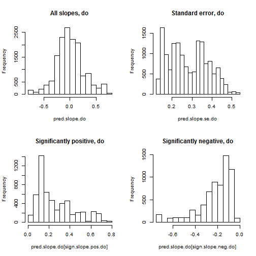


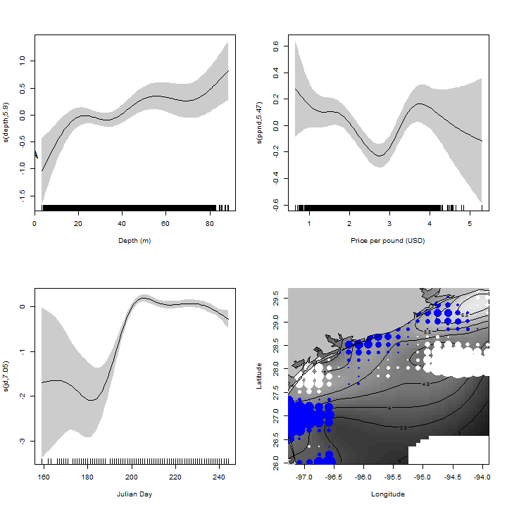


Model effects for the Average Duration model
